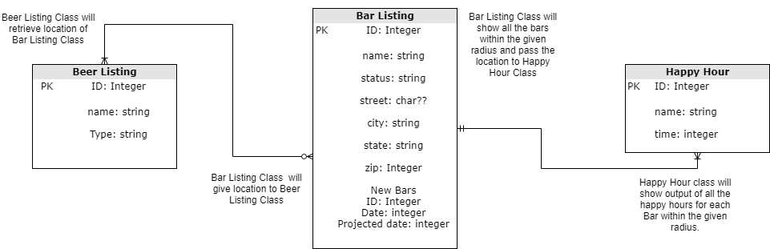

# Beer Buddy!

#Milestone #1

### Brief Overview

This app will be appealing to anyone who loves beer! (of course 21+) It will help you locate
breweries around your area, by mapping it out right on your mobile device. (using Google Maps) 
When you click on the different breweries you will be able display top brewery they carry, 
the hours they are open, any specials/event that are happening that day and of course a link to their
homepage. The app will be capable of a search-by-beer options as well, to narrow down where you can
purchase the specific beer. This can be at a local store, a brewery, or a bar. Another option is 
you will have access to the newest spots that are opening up. Lastly you will also see the Top 
Breweries that are in the area. Persist data I would like to keep the user’s favorite beer places and 
previous drink searches.

* [License](docs/License.md)

* [User stories](docs/user-stories.md)

* [First Wireframes](docs/wireframes.md)

* [First ERD](docs/erd.md)

    *  
    
    *  [Click for ERD in pdf](docs/ERD-1.pdf)
    
    
    
# Milestone #2

Please [click](docs/Milestone-Deliverable.md) here to see the process of my deliverable.

# License
Copyright 2019 Anita Martin. All rights reserved.
Please [click](docs/License.md) here for license information.

# DDL for Data Model

* [Data Model](docs/data-model.md)

# Java Documentation

* [Java Docs](docs/api/overview-summary.html)

# Description of Current Sate of App
The app Beer Buddy is not complete and still has a lot of work left to do on it. 69 Warnings
and 1 weak warning are present at the moment (According to the Code Inspection that I ran).
When you first open the app it will bring you to a log-in screen and once you get pass that
you should be able to see the first fragment which it the Bar Fragment. You can fill in the 
information but it does nothing yet, the list view does not display anything yet either.  
 
* Hit List to work on:
    1. Get rid of the Errors and as much warnings as possible.
    2. Incorporate the API (Untappd) that I have to fill my database.
    3. Get buttons to work properly in all the Fragments(updating, clearing, add buttons)
    4. Bugs/errors that pop up are the following in this [list](docs/List-of-Errors.md).
    
# Android API Versions and Emulator
  - API Version: 
    - Minimum of 21 and a maximum of 28
  - Emulator Version: 
    - Nexus 5K
    - PlayStore Compatible: Yes
    - Size: 5.2"
    - Resolution: 1080x1920
    - Density: 420dpi
    
# Third Party Libraries
- Stetho (Facebook)
- Clarify
- Retrofit
- AndroidX
- Reactive
- GSon

# External Services
- Google Services (Sign- in and Maps)
- UnTappd Drink Socially

# Aesthetic and Cosmetic
Beer Buddy is not functioning at the moment like its suppose to. 
Here is the list of things I would like to accomplish for it to work properly:
1. Get the API connection to import the database.
2. Get buttons to work so you can filter by inputted information.

# Stretch Goals
1. Add in Google Maps and place makers at all the Bars.
2. Add in self-made icons and spruce it up to make it more presentable.
3. Add in a personal logo.

# Instructions for building the App
Click [here](docs/BuildingTheApp.md) on instructions for the implementation of Beer Buddy.

# Instructions for using the App
Click [here](docs/InstructionsForBeerBuddy.md) on using Beer Buddy.

